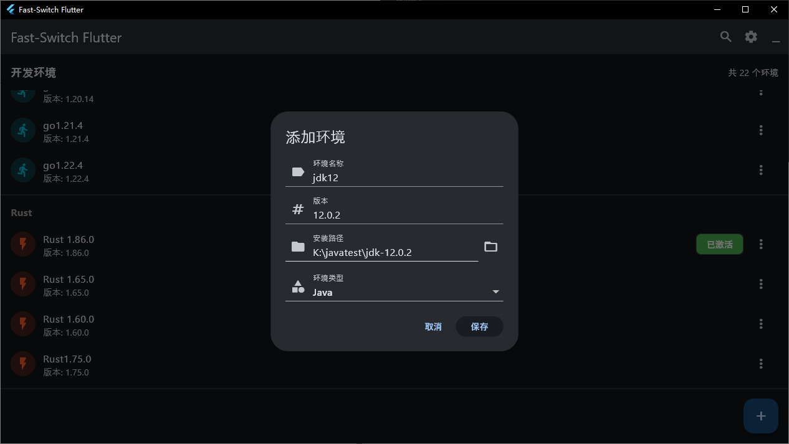

# Fast-Switch

> **注意：本软件仅供个人和非商业用途。任何商业使用需事先获得作者书面许可。**

Fast-Switch是一款高效的开发环境切换工具，帮助开发者轻松管理和切换各种开发环境。

## 主要功能

- 自动检测系统中安装的Java、Maven、Node.js、Python、Go、Rust等环境
- 一键切换不同版本的开发环境
- 系统托盘快速访问，方便操作
- 自动配置环境变量，无需手动修改系统设置
- 高效稳定，提升开发效率

## 下载安装
- [点击下载最新版本](https://bgithub.xyz/Jia0808/FAST-SWITCH/releases/download/v1.0.0/Fast-Switch-Setup.exe)

## 安装流程

## 使用说明

1. 下载并安装Fast-Switch
2. 软件会自动扫描并检测系统中已安装的开发环境
3. 添加环境，点击右下角 “＋”

3. 在主界面选择需要激活的环境版本

4. 点击"激活"按钮即可切换环境

## 系统要求

- Windows 10/11 (64位)
- 需要管理员权限以修改系统环境变量

## 联系方式

如有任何问题或商业合作需求，请通过以下方式联系：
- 邮箱：[xin980605@163.com]
- QQ/微信：[NNian2020812]
