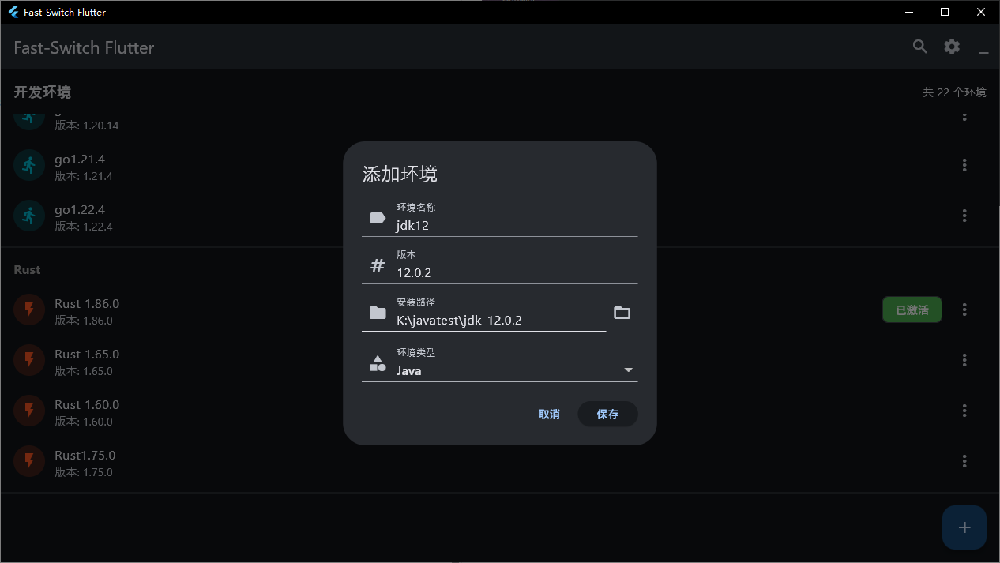
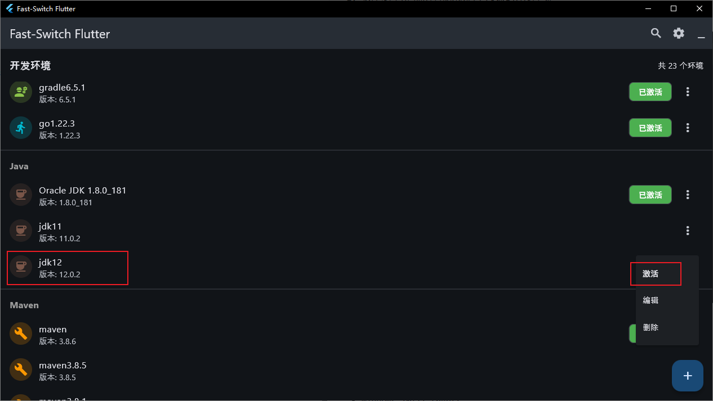
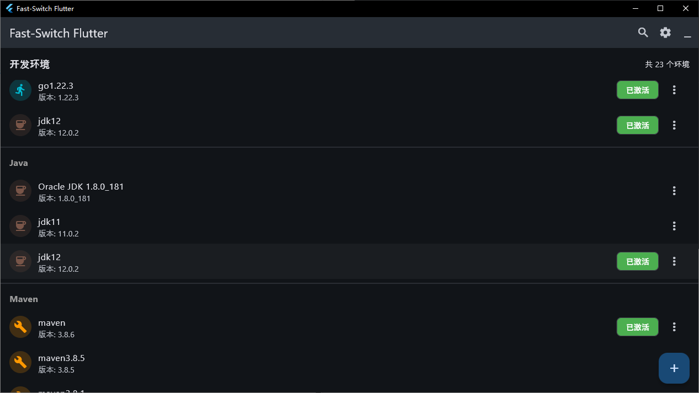

# Fast-Switch

> **Note: This software is for personal and non-commercial use only. Any commercial use requires prior written permission from the author.**

Fast-Switch is an efficient development environment switching tool that helps developers easily manage and switch between various development environments.

## Main Features

- Automatically detects Java, Maven, Node.js, Python, Go, Rust and other environments installed on your system
- One-click switching between different versions of development environments
- Quick access via system tray for convenient operation
- Automatic configuration of environment variables without manual system settings modification
- Efficient and stable, improving development productivity

## Download and Installation
- [Click to download the latest version](https://bgithub.xyz/Jia0808/FAST-SWITCH/releases/download/v1.0.0/Fast-Switch-Setup.exe)

## Installation Process

## Usage Instructions

1. Download and install Fast-Switch
2. The software will automatically scan and detect development environments installed on your system
3. Add environment by clicking the "+" button in the bottom right corner

4. Select the environment version you need to activate in the main interface

5. Click the "Activate" button to switch environments

## System Requirements

- Windows 10/11 (64-bit)
- Administrator privileges required to modify system environment variables

## Contact Information

For any questions or business cooperation requests, please contact:
- Email: [xin980605@163.com]
- QQ/WeChat: [NNian2020812]
